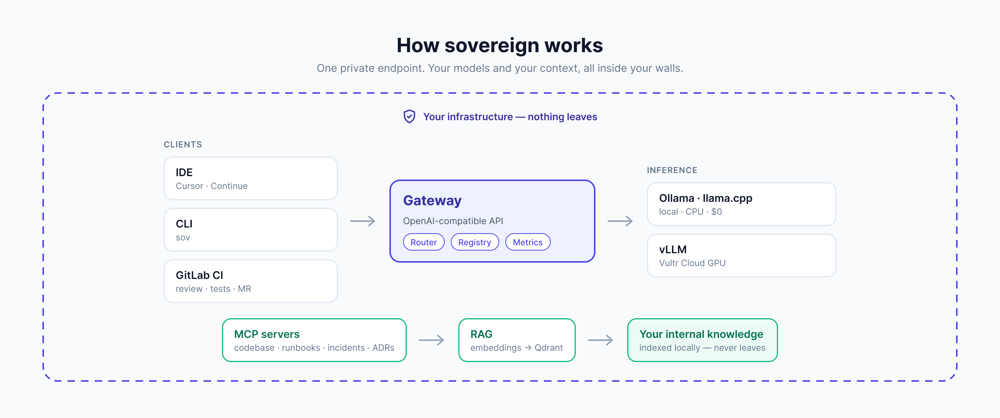
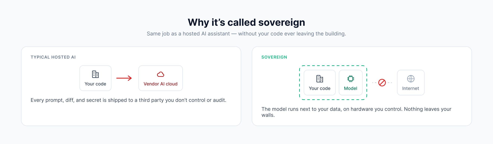
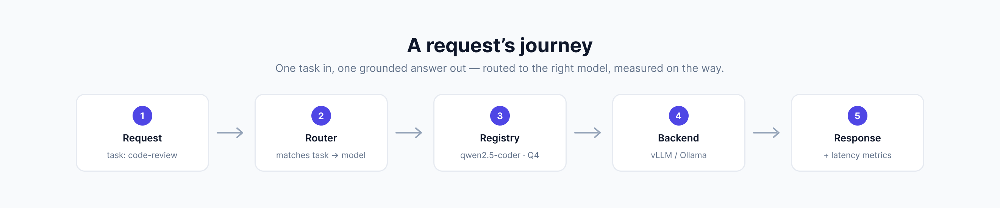

# sovereign

**Your engineering team's AI, running entirely on your own infrastructure.**

`sovereign` is a self-hosted AI platform for software teams. It gives your engineers a private
code assistant, context-aware tools that understand your *own* codebase and operational history,
and AI built into your CI/CD — all powered by open models that run on hardware **you** control.
Your source code, your incident history, and your architecture docs never leave your walls.

<p align="center">
  
</p>

---

## The problem

Modern AI coding tools are wonderful, and almost all of them are **someone else's cloud**. The
moment your assistant is a hosted SaaS, three things happen:

1. **Your code leaves.** Every prompt, file, and diff is shipped to a third party. For proprietary
   source, unreleased features, incident post-mortems, and security-sensitive systems, that is a
   data-governance and breach-surface problem — not a hypothetical one.
2. **You lose control of the model.** It changes when the vendor changes it. You can't pin a
   version, audit it, or run it in an air-gapped environment.
3. **Your context is shallow.** A generic assistant doesn't know your runbooks, your past outages,
   or why your team chose Postgres over a document store. It guesses; it doesn't *know*.

`sovereign` solves all three by keeping **both the model and the data in-house**.

## ELI5 — explain it like I'm five

> **What is this?** Imagine a really smart robot helper that reads code and answers questions. Most
> smart helpers live in someone else's building, so to ask them anything you have to mail them a copy
> of your private notebook. `sovereign` is a smart helper that lives in **your own building**. It
> reads your notebook right there on your desk and never mails a copy anywhere.

A few of the ideas, in plain language:

- **Open model.** The "brain" of the helper. "Open" means the brain is downloadable and free to run
  yourself (models like Qwen, Llama, Mistral, DeepSeek) — so you can keep it in your building instead
  of renting one you can only reach over the internet.
- **Self-hosting / inference.** "Inference" is just *the robot thinking up an answer.* Self-hosting
  means that thinking happens on **your** computers (a laptop for small jobs, a rented GPU for big
  ones), not a stranger's.
- **Sovereignty / no egress.** "Egress" is data leaving your building. `sovereign`'s promise is
  **zero egress**: your code and secrets stay put. That's the whole point — you stay *sovereign* over
  your data.
- **MCP (Model Context Protocol).** A standard set of "doors" the helper can knock on to look things
  up — one door to your code, one to your runbooks, one to your past incidents, one to your
  architecture decisions. Instead of guessing, the helper opens the right door and reads.
- **RAG (Retrieval-Augmented Generation).** Before answering, the helper **retrieves** the few most
  relevant pages from your own documents and reads them first, so its answer is grounded in *your*
  reality, not the internet's average.
- **Quantization.** Making the brain smaller and faster so it fits on cheaper hardware — like
  shipping a thick book as a lighter paperback that's still perfectly readable.
- **Routing & the registry.** A **registry** is the list of which brains you have; **routing** is a
  receptionist who sends each question to the best brain for that job (one model is great at writing
  code, another at reviewing it).

If you remember one sentence: **`sovereign` is a private, in-house AI for engineers that knows your
own code and never leaks it.**

## What it does

- **Private code assistant** — chat, code generation, review, and test writing from your IDE or the
  terminal, answered by open models on your own infrastructure.
- **Knows *your* world** — MCP servers expose your codebase, runbooks, incident history, and
  architecture docs to the assistant, grounded by a local retrieval (RAG) layer. Ask "has this failed
  before?" and get a real answer from your own post-mortems.
- **AI in your pipeline** — automated code review, test generation, and merge-request summaries wired
  into GitLab CI/CD, every call hitting your internal endpoint instead of a third party.
- **Runs the model lifecycle** — a registry that versions models, routes each task to the best one,
  quantizes them to fit your hardware, and benchmarks them so choices are made on evidence.
- **Deploys where you want** — a laptop for $0 local development, or Vultr Cloud GPU for production,
  behind one stable, OpenAI-compatible endpoint so nothing downstream has to change.

## How it works

One endpoint sits in the middle. Every client — your IDE, the CLI, CI jobs — talks to the
**gateway**, which speaks the standard OpenAI API. The gateway looks up the right model in its
**registry**, routes the request, and forwards it to whichever **inference backend** is serving that
model (a small quantized model on your laptop for dev; vLLM on a Vultr GPU for production). Alongside
it, **MCP servers** answer "what does our team know about X?" by **retrieving** the most relevant
snippets from your indexed internal knowledge (the **RAG** layer, backed by a local vector database).

<p align="center">
  
</p>

<p align="center">
  
</p>

Two ways to run the exact same system:

- **Local (\$0).** `docker compose up` runs the gateway, a small quantized model via Ollama/llama.cpp,
  and the vector database on a single machine. This is the everyday development path.
- **Vultr (production).** Terraform + Helm provision Cloud GPU, Kubernetes (VKE), and Object Storage,
  serving the same models with vLLM. Model performance is benchmarked on real Vultr hardware so the
  numbers you see are measured, not guessed.

## Capabilities at a glance

| Capability | Component |
|---|---|
| Evaluate & curate open models (Qwen, Llama, Mistral, DeepSeek) for code-gen / review / test-gen | [`eval/`](./eval) |
| MCP servers over internal context — codebase, runbooks, incidents, architecture | [`mcp_servers/`](./mcp_servers) |
| AI in CI/CD — automated review, test generation, MR summaries (GitLab) | [`.gitlab-ci.yml`](./.gitlab-ci.yml) · [`ci/`](./ci) |
| Model lifecycle — versioning, routing, quantization, benchmarking | [`gateway/`](./gateway) |
| Inference — vLLM on GPU (prod) / llama.cpp · Ollama (local) | [`inference/`](./inference) |
| RAG over internal knowledge with a local embedding model + vector DB | [`rag/`](./rag) |
| IDE tooling backed by an internal, OpenAI-compatible endpoint | [`ide/`](./ide) |
| Adoption & impact measurement | [`adoption/`](./adoption) |
| Operator dashboard — health, registry, leaderboard, adoption, context | [`dashboard/`](./dashboard) · [`dashboard_api/`](./dashboard_api) |
| Infrastructure as code — Vultr Cloud GPU, VKE, Object Storage | [`infra/`](./infra) |

## Quick start (local)

```bash
cp .env.example .env
uv sync --extra gateway --extra dev
docker compose up -d ollama gateway
docker compose exec ollama ollama pull qwen2.5-coder:1.5b

# talk to it with any OpenAI-compatible client:
curl localhost:8080/v1/chat/completions \
  -d '{"model":"code-review","messages":[{"role":"user","content":"Review this diff for bugs."}]}'
```

## Documentation

Full docs live in [`docs/`](./docs): the [architecture](./docs/architecture.md) (system diagram +
data flow), [decision records](./docs/adr) (serving engine, gateway vs LiteLLM, Qdrant vs pgvector,
local vs Vultr GPU), a $0 [hands-on workshop](./docs/workshop.md), the
[model/quantization/cost tradeoffs](./docs/tradeoffs.md), and a
[role → feature traceability matrix](./docs/traceability.md).

## Project status

`sovereign` is built in the open. The gateway and model registry/routing, the MCP servers, the RAG
layer, model evaluation and lifecycle, the GitLab CI/CD AI jobs, IDE tooling, adoption metrics, the
operator dashboard, and the Vultr infrastructure-as-code are all in place — each directory has its
own README, and the [traceability matrix](./docs/traceability.md) maps every capability to where it's
demonstrated. The operator dashboard was built through its design gate ([`VIEWS.md`](./VIEWS.md) →
Figma mocks → approval). The larger multi-GPU VKE topology is architected and costed but not stood
up; the single-A16 benchmark numbers are measured on real Vultr hardware — the docs are precise about
that boundary.

## A note on data

Everything under [`sample_data/`](./sample_data) is **fictitious** — a made-up company ("Meridian
Logistics") that stands in for your real internal knowledge so the retrieval and MCP layers have
something to index in a public repository. Point the ingestion at your own code, runbooks, and
incidents to make it yours.

## License

[MIT](./LICENSE). `sovereign` is an independent project and is not affiliated with or endorsed by
Vultr; third-party model names are trademarks of their respective owners. See [`NOTICE`](./NOTICE).
