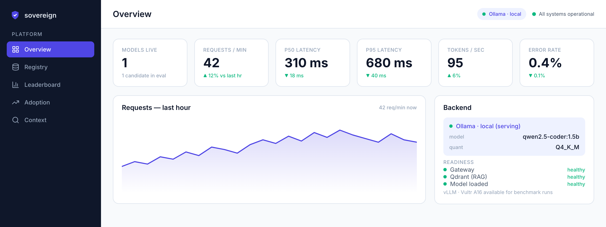
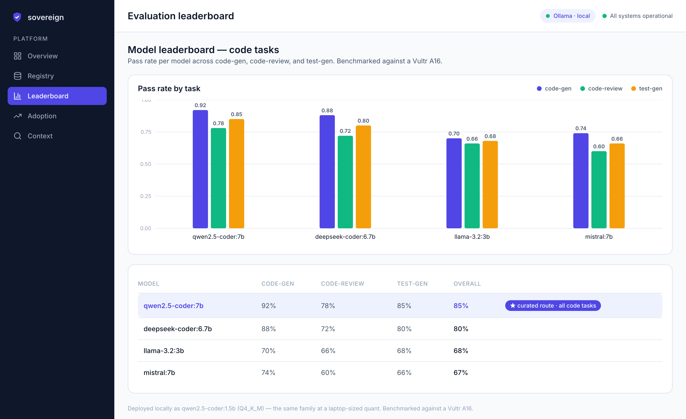

# dashboard

The operator **dashboard** for the sovereign platform (build-order Step 5) — a
Vite + React + TypeScript SPA. It's an observability surface, not a chat UI:
five read-only views over the platform's health, models, evaluation, adoption,
and indexed context.

> Greenfield UI built to the **approved Figma mocks** (see `../VIEWS.md`) through
> the mock-approval gate. Design system: dark slate sidebar + shield wordmark,
> near-white canvas, white cards (1.5px slate border, 14px radius), Inter, indigo
> `#4F46E5` / emerald `#10B981` accents — all in `src/styles/tokens.css`.





## Views

| Route | View | Renders |
|---|---|---|
| `/` | Overview | health stat tiles · requests area chart · backend/readiness panel |
| `/registry` | Model registry | model table (active/candidate) · task→model routing |
| `/leaderboard` | Evaluation leaderboard | grouped bar chart · ranked table, curated winner |
| `/adoption` | Adoption & impact | usage stat tiles · 30-day bar chart · by-surface split |
| `/context` | Context browser | indexed-source inventory · retrieval preview |

## Data

Views fetch from the read-only **`dashboard_api`** backend (`../dashboard_api/`).
Real data (model registry, sample_data doc counts) is served as-is; the rest is
illustrative fixtures matching the mocks (public-repo rule — synthetic only).

## Develop

```bash
# 1. backend (from the repo root, with .[dashboard] installed)
uvicorn dashboard_api.app:app_factory --factory --port 8090

# 2. frontend (this dir) — proxies /api → :8090
npm install
npm run dev            # http://localhost:5173
```

Other scripts: `npm run build`, `npm run preview`, `npm run lint`,
`npm run typecheck`, `npm test` (vitest).

## Docker

`docker compose up dashboard` builds the SPA and serves it via nginx on
`:5173`, proxying `/api/*` to the `dashboard-api` service. No charting or UI
dependency — the SVG charts are hand-rolled in `src/components/charts.tsx`.
