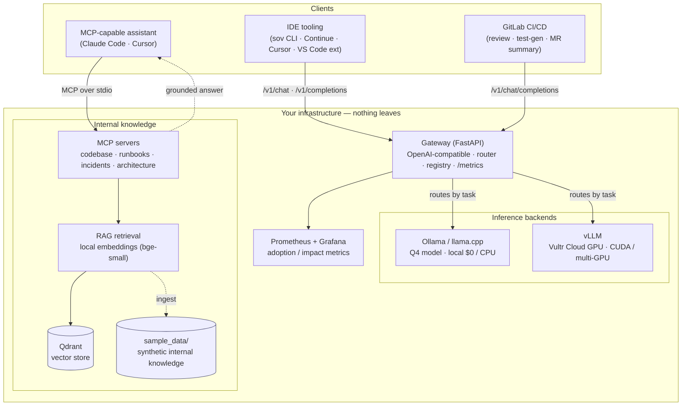

# Architecture

`sovereign` is a self-hosted AI platform for engineering teams. Its one organizing principle is a
**sovereignty boundary**: the model *and* the data live inside your infrastructure, and no prompt,
diff, embedding, or retrieval call crosses out to a third party. Everything below is arranged around
that boundary.

## System diagram

> The diagram renders natively on GitHub. Rendered PNGs of the same idea (request lifecycle,
> sovereign-vs-SaaS, leaderboard) live in [`assets/`](./assets) and are embedded in the root
> [`README.md`](../README.md).

## The pieces

| Layer | Component | What it does | Dir |
|---|---|---|---|
| **Entry** | Gateway | One OpenAI-compatible endpoint; routes each request's *task* to the right model; exposes `/metrics`, `/healthz`, `/readyz` | [`gateway/`](../gateway) |
| **Serving** | Inference | Ollama/llama.cpp locally ($0/CPU), vLLM on Vultr GPU (prod) — swappable behind the gateway | [`inference/`](../inference) |
| **Knowledge** | MCP servers | Expose codebase, runbooks, incidents, architecture to any MCP client | [`mcp_servers/`](../mcp_servers) |
| **Knowledge** | RAG | Ingest → local embeddings → Qdrant → retrieval API that grounds the MCP servers | [`rag/`](../rag) |
| **Lifecycle** | Eval | Score/curate models on code-gen, review, test-gen; quantize; benchmark; promote/rollback the registry | [`eval/`](../eval) |
| **Pipeline** | CI jobs | AI review, test generation, MR summaries wired into GitLab, calling the internal gateway | [`ci/`](../ci) |
| **Surface** | IDE tooling | `sov` CLI, Continue, Cursor, a VS Code FIM-completion extension | [`ide/`](../ide) |
| **Measure** | Adoption | Turn gateway metrics + acceptance signals into an impact report; Grafana dashboard | [`adoption/`](../adoption) |
| **Platform** | Infra | Terraform (Vultr GPU/VKE/Object Storage) + Helm; the one applied-for-real A16 benchmark | [`infra/`](../infra) |

## Data flow — a request's journey

Two request shapes travel the system. Both stay inside the boundary end to end.

### 1. A completion (IDE / CLI / CI → gateway → model)

1. A client — the `sov` CLI, a Continue autocomplete, a CI review job — sends a standard OpenAI
   request to the gateway. The `model` field is a **task name** (`code-review`, `code-gen`,
   `test-gen`, `chat`), not a concrete model.
2. The gateway's **router** looks the task up in [`registry.yaml`](../gateway/registry.yaml) and
   resolves it to a concrete model + backend (e.g. `qwen2.5-coder:1.5b` on Ollama locally, or an
   AWQ-quantized coder model on vLLM in production).
3. The request is forwarded to that **inference backend** over the same OpenAI protocol. Streaming
   and `/v1/completions` (fill-in-the-middle) are supported for autocomplete.
4. The response returns to the client; the gateway records request count, latency, and tokens/sec to
   Prometheus. The **adoption** collector reads those metrics later to compute impact.

### 2. A grounded question (assistant → MCP → RAG → your knowledge)

1. An MCP-capable assistant calls a tool like `query_incidents` or `search_runbooks` over stdio.
2. The MCP server hands the query to the **RAG** layer, which embeds it with a **local** model
   (`bge-small`) and retrieves the most relevant chunks from **Qdrant** (or the zero-setup in-memory
   index for offline use).
3. The server returns those grounded snippets — drawn from *your* runbooks and post-mortems, never
   the internet's average — to the assistant, which uses them to answer.
4. No embedding or retrieval call leaves the machine. This is what makes "has this failed before?"
   answerable from your own history.

## Deployment topologies

| | Local ($0) | Vultr (production) |
|---|---|---|
| **Serving** | Ollama / llama.cpp, CPU, Q4 model | vLLM, Cloud GPU (A16 → L40S), CUDA / multi-GPU |
| **Vector store** | Qdrant in Docker (or in-memory) | Qdrant on VKE |
| **Orchestration** | `docker compose` | Terraform + Helm on VKE + Object Storage |
| **Cost** | $0 (everyday dev) | metered; see [`infra/cost.md`](../infra/cost.md) |

The interface is identical across both — one OpenAI-compatible endpoint — so IDEs, the CLI, and CI
never change when you move a model from a laptop to a GPU. See the ADRs in [`adr/`](./adr) for why
each of these was chosen, and [`tradeoffs.md`](./tradeoffs.md) for the model/quantization/cost
reasoning.

## The honest boundary

Single-A16 latency/throughput/tokens-per-sec numbers in the leaderboard are **measured** on real
Vultr hardware (`make bench-vultr`). The larger multi-GPU, tensor-parallel VKE topology is
**architected and costed** — expressed in the Helm `values.yaml` (`vllm.gpus > 1`) and Terraform —
but not stood up in the $0 build. The docs never present projected numbers as measured ones.
