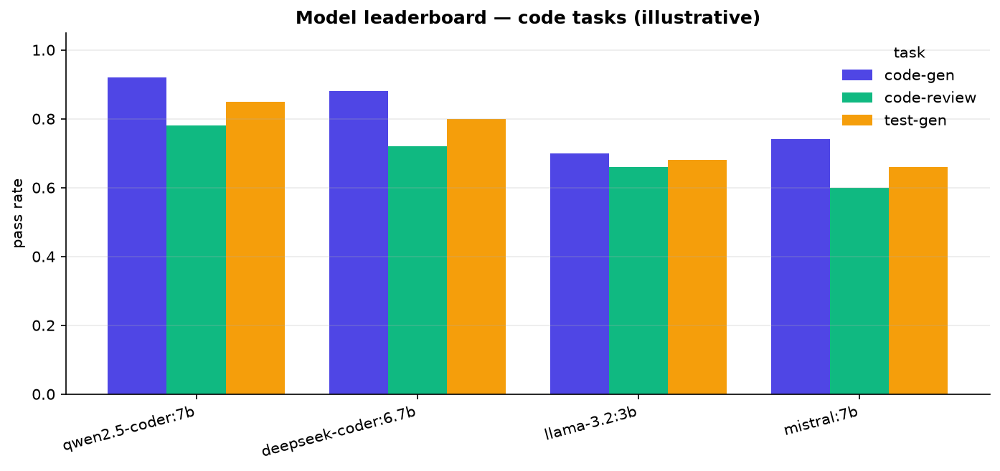

# eval

Evaluate and **curate** open models, and run the **model lifecycle** — the evidence behind which
model the registry routes each task to.

## Evaluate
Three capabilities are scored, and "correct" is defined and checked, not eyeballed:
- **code-gen** — generated code is **executed** against hidden tests (sandboxed subprocess).
- **test-gen** — the model's generated tests are **run** against a reference implementation.
- **code-review** — a keyword judge over the planted-bug terms (swap in `judge_review_with_model`
  for a real LLM-as-judge).

Every model is reached through the gateway's OpenAI-compatible endpoint, so any served model is
evaluable:

```bash
uv run python -m eval --models qwen2.5-coder:1.5b,deepseek-coder:6.7b --gateway http://localhost:8080
```

This writes `results/leaderboard.{json,md,png}`. Example output:



> The chart above uses illustrative numbers; run the command against real served models for measured
> scores. Benchmarks are designed to run against a Vultr A16 (Step 7) so the numbers are real.

## Curate
`--curate` writes the winning model per task back into `gateway/registry.yaml` routing — turning eval
evidence into the platform's actual behavior.

## Lifecycle
- **`quantize.py`** — merged HF model → GGUF (Q4/Q5/Q8) via llama.cpp (AWQ for the vLLM path).
- **`bench.py`** — latency / throughput / tokens-per-sec per model (runs against the gateway).
- **`registry_ops.py`** — `promote` / `rollback` the default route (returns the previous default).

_Built in build-order Step 3._
